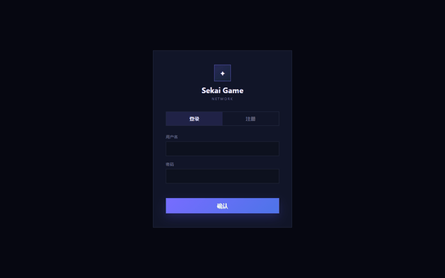

# 馃幋 Sekai Duel 路 澶滄洸鍐虫枟

> **鍩轰簬娓告垙鐜嬭鍒?+ WebSocket 瀹炴椂瀵规垬 + Godot 4 瀹㈡埛绔殑浜屾鍏冨崱鐗屾父鎴?*
> A Yu-Gi-Oh! rules card game with WebSocket real-time PvP and a Godot 4 client

[](https://www.oracle.com/java/)
[](https://spring.io/projects/spring-boot)
[](https://developer.mozilla.org/docs/Web/API/WebSockets_API)
[](https://spring.io/projects/spring-data-jpa)
[](https://godotengine.org/)
[](https://en.wikipedia.org/wiki/Yu-Gi-Oh!_Trading_Card_Game)
[](LICENSE)

An anime-style card duel game implementing **Yu-Gi-Oh! rules**, with a **Java Web backend** and a **Godot 4 client**, supporting **real-time PvP battles** over WebSocket.

涓€娆惧疄鐜版父鎴忕帇瑙勫垯鐨勪簩娆″厓鍗＄墝鍐虫枟娓告垙锛?*Java Web 鍚庣 + Godot 4 瀹㈡埛绔?*锛屾敮鎸?**WebSocket 瀹炴椂 PvP 瀵规垬**銆?

<p align="center">
  
</p>
---

## 馃梻锔?Project Structure / 椤圭洰缁勬垚

### SekaiGame (Java Backend)

- Spring Boot + WebSocket + Spring Data JPA + MySQL
- Account system, collection system
- PvP real-time battle WebSocket relay service (`/ws/pvp`)
- Full Yu-Gi-Oh! rule engine: summon, spell/trap activation, battle phase, direct attacks, token summoning, effect resolution
- 300+ cards with effects, rarities, starter packs, and a card pack system

### SekaiGameGodot (Godot 4 Client)

- Godot 4.7 native client
- 368 valid cards imported
- Deterministic shuffling, opening hands, drawing, turn switching
- Monster summoning, spell activation, setting cards, battle & direct attacks
- Core effect dispatch, basic AI turns
- `/ws/pvp` message protocol
- See `SekaiGameGodot/README.md`

## 鈻讹笍 Quick Start / 蹇€熷紑濮?
### Backend / 鍚庣

```powershell
cd SekaiGame
# 1. Create MySQL database & set env vars
$env:MYSQL_PASSWORD = "your-db-password"   # same as in application.yml
$env:JWT_SECRET = "your-jwt-secret"
# 2. Run
mvn spring-boot:run
```

### Godot Client / Godot 瀹㈡埛绔?
Open the `SekaiGameGodot` folder with Godot 4.7.1.

## 馃摑 Notes / 璇存槑

- **Card images are NOT included** due to copyright. The game data (stats, effects, rarities) is fully included 鈥?add your own card art under `SekaiGame/src/main/resources/static/assets/cards/` or replace with generated placeholders. 鍗￠潰绱犳潗鍥犵増鏉冮棶棰樻湭鍖呭惈锛屽崱鐗屾暟鎹畬鏁翠繚鐣欙紝璇疯嚜琛屽噯澶囧崱闈㈠浘鐗囥€?- MySQL database name: `sekai_friend`
- Secrets are read from environment variables 鈥?never hardcode them.

## 馃搫 License

[MIT](LICENSE) 漏 2026 [sekai-lyr](https://github.com/sekai-lyr)

---

**猸?If this project helped you, star it! 濡傛灉杩欎釜椤圭洰瀵逛綘鏈夊府鍔╋紝娆㈣繋 Star锛?*
